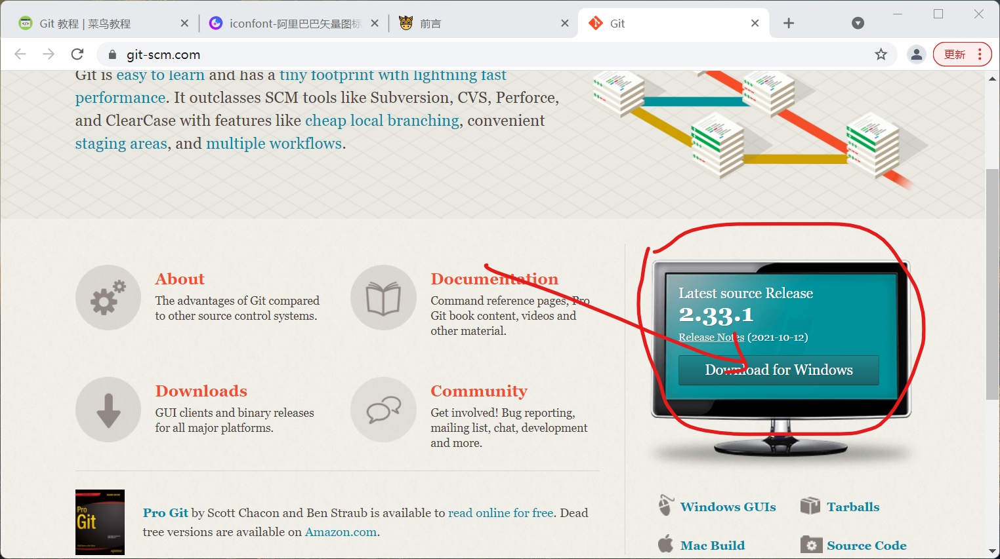
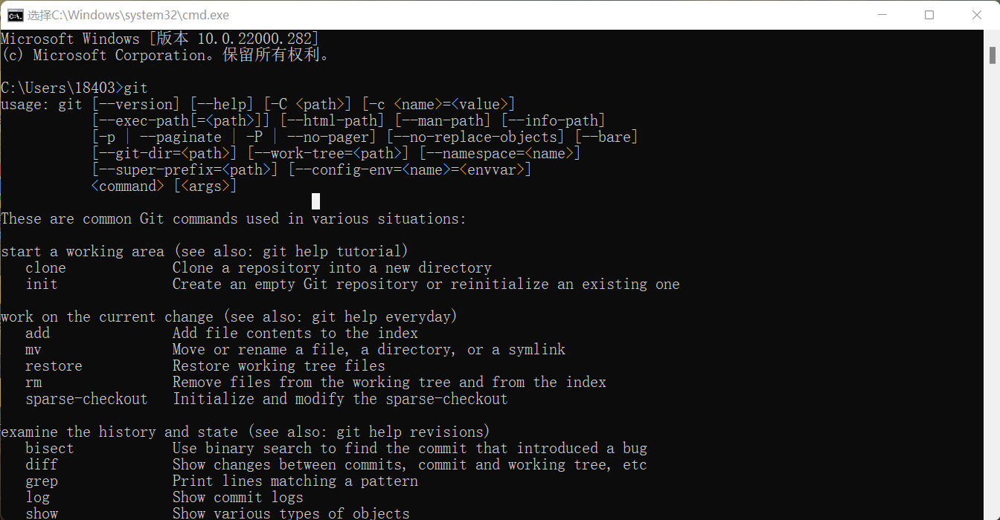
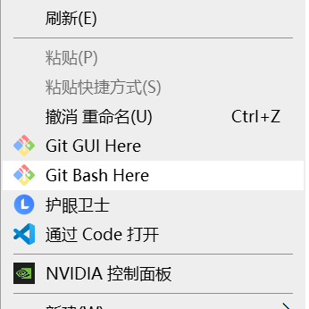
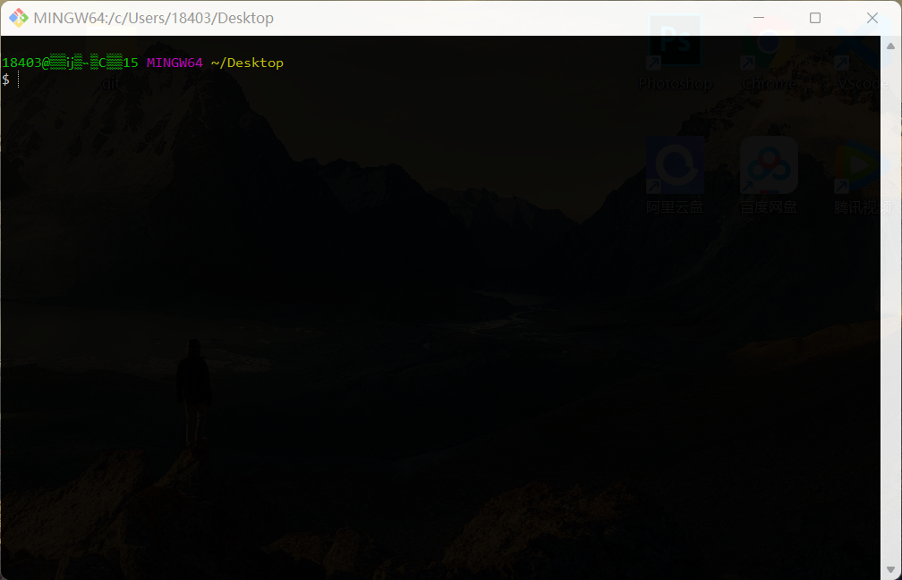

# Git 简介


> [Git](https://git-scm.com/) 是一个开源的分布式版本控制系统，可以有效、高速地处理从很小到非常大的项目版本管理。也是[林纳斯·本纳第克特·托瓦兹](https://baike.baidu.com/item/%E6%9E%97%E7%BA%B3%E6%96%AF%C2%B7%E6%9C%AC%E7%BA%B3%E7%AC%AC%E5%85%8B%E7%89%B9%C2%B7%E6%89%98%E7%93%A6%E5%85%B9?fromtitle=Linus+Torvalds&fromid=9336769)为了帮助管理`Linux`内核开发而开发的一个开放源码的版本控制软件。


**********


# Git 安装与配置

下载Git  [Git官网](https://git-scm.com/)



<font style="color:red;">傻瓜式安装点点 next</font>

安装后，打开**cmd** 输入`git` 如下图，则成功！ 




*****

>  配置`Git`，鼠标右键`Git Bash Here` 打开如下窗口





>  配置`Git`邮箱和用户名

```bash
git config --global user.name "你的名字"
git config --global user.email "邮箱"
```

!> 备注：以上两步的名字和邮箱可随意配置，但最好使用自己的邮箱。
如果用了 `--global` 选项，那么更改的配置文件就是位于你用户主目录下的那个，以后你所有的项目都会默认使用这里配置的用户信息。
如果要在某个特定的项目中使用其他名字或者电邮，只要去掉 `--global` 选项重新配置即可，新的设定保存在当前项目的 `.git/config` 文件里。

```bash
git config user.name 用于查看配置的姓名
git config user.email 用于查看配置的邮箱
git config --list 检查已有的配置信息
```

!> 因为Git是分布式版本控制系统，所以每个机器都必须自报家门：你的名字和Email地址。


******

# Linux 简单命令

> 简单了解以下就行了....

```bash
mkdir xxx 新建文件夹

vi x.txt 新建文件（Visual editor） /输入 i 进入编辑模式

ESC + ：+ wq 保存并退出

ESC + ：+ q! 不保存并退出

cd xxx 进入xxx目录

cd .. 返回上一级目录

ls 列出当前文件夹中所有文件

pwd 显示当前目录

cat x.txt 显示文件内容

clear 清屏
```

********

# Git 工作区、暂存区和版本库
工作区、版本库中的暂存区和版本库之间的关系：


- **工作区：**就是你在电脑里能看到的目录。
- **暂存区：**英文叫 stage 或 index。一般存放在 .git 目录下的 index 文件（.git/index）中，所以我们把暂存区有时也叫作索引（index）。
- **版本库：**工作区有一个隐藏目录 .git，这个不算工作区，而是 Git 的版本库。

## 工作流程
- 图中左侧为工作区，右侧为版本库。在版本库中标记为 "index" 的区域是暂存区（stage/index），标记为 "master" 的是 master 分支所代表的目录树。

- 图中我们可以看出此时 "HEAD" 实际是指向 master 分支的一个"游标"。所以图示的命令中出现 HEAD 的地方可以用 master 来替换。

- 图中的 objects 标识的区域为 Git 的对象库，实际位于 ".git/objects" 目录下，里面包含了创建的各种对象及内容。

- 当对工作区修改（或新增）的文件执行 git add 命令时，暂存区的目录树被更新，同时工作区修改（或新增）的文件内容被写入到对象库中的一个新的对象中，而该对象的ID被记录在暂存区的文件索引中。

- 当执行提交操作（git commit）时，暂存区的目录树写到版本库（对象库）中，master 分支会做相应的更新。即 master 指向的目录树就是提交时暂存区的目录树。

- 当执行 `git reset HEAD` 命令时，暂存区的目录树会被重写，被 master 分支指向的目录树所替换，但是工作区不受影响。

- 当执行 `git rm --cached <file>` 命令时，会直接从暂存区删除文件，工作区则不做出改变。

- 当执行 `git checkout .` 或者 `git checkout -- <file>` 命令时，会用暂存区全部或指定的文件替换工作区的文件。这个操作很危险，会清除工作区中未添加到暂存区中的改动。

- 当执行 `git checkout HEAD .` 或者 `git checkout HEAD <file>` 命令时，会用 HEAD 指向的 master 分支中的全部或者部分文件替换暂存区和以及工作区中的文件。这个命令也是极具危险性的，因为不但会清除工作区中未提交的改动，也会清除暂存区中未提交的改动。

*******

# 创建版本库
> Git 使用 `git init` 命令来初始化一个 Git 仓库，Git 的很多命令都需要在 Git 的仓库中运行，所以 `git init` 是使用 Git 的第一个命令。
> 在执行完成 `git init` 命令后，Git 仓库会生成一个 .git 目录，该目录包含了资源的所有元数据，其他的项目目录保持不变。

## Git init
1. 使用当前目录作为`Git`仓库，我们只需使它初始化。

```bash
git init    //该命令执行完后会在当前目录生成一个 .git 目录。
```
2. 使用我们指定目录作为Git仓库。

```bash
git init 目录名
```
初始化后，会在你定义的目录下会出现一个名为 .git 的目录，所有 `Git` 需要的数据和资源都存放在这个目录中。

# 基本操作
> 创建了`git`仓库,还要用一些命令管理git的仓库 **一定要熟记，熟用...**
## 提交到缓冲区
以下命令可以将工作区的文件提交到缓冲区，再通过`git commit`命令提交到版本库进行管理。
```bash
git add 文件名.后缀   //添加一个或多个文件到暂存区
git add 目录名  //添加指定目录到暂存区，包括子目录
git add .  //添加当前目录下的所有文件到暂存区
```

********

## 提交到版本库
提交到版本库了后，就可以进行进行一系列的操作了，比如：版本回退 版本穿梭 版本控制
```bash
git commit -m "版本相关的信息"  //将暂存区提交到版本库中
git commit 文件名.后缀 -m "信息"  //提交暂存区的指定文件到版本库
```

*************

## 查看日志
在提交了若干更新，又或者克隆了某个项目之后，你也许想回顾下提交历史。 完成这个任务最简单而又有效的工具是 git log 命令。
```bash
git log  //查看历史提交记录
git log --oneline  //精简日志一行一条提交记录
git reflog  //每次提交commit的id
```

**************

## 差异对比
显示项目的两个不同版本之间的差异，或者显示指定文件的不同之处
```bash
git diff  //比较暂存区与工作区
git diff --cached  //比较版本区与暂存区
git diff master  //比较版本区与工作区
```

**********

## 版本控制

```bash
git reset --hard HEAD^    //回退到上一次提交,多加个^可以到上上个，因此类推。
git reset --hard Obfafd    //回退到指定Obfafd的commit id版本
git reset HEAD   		//用版本库中的文件去替换暂存区的全部文件
git checkout -- 文件名.后缀    	//用暂存区指定文件去替换工作区的指定文件（危险）
git checkout HEAD 文件名.后缀  //用版本库中的文件替换暂存区和工作区的文件（危险）
```

*******
## 删除文件
如果你在文件夹中删掉文件，只是删掉了工作区里面的文件，缓冲区，工作区中的相应文件并没有删掉，所以者时候就要用到`git`的删除命令了。
```bash
git rm 文件名.后缀  //将文件从暂存区和工作区中删除
git rm -f 文件名.后缀  //如果删除之前修改过并且已经放到暂存区域的话，则必须要用强制删除选项 -f
git rm --cached  文件名.后缀  //将文件从暂存区中删除
git rm -r 文件夹名  //删除文件夹
```

******************

# 分支管理
>几乎每一种版本控制系统都以某种形式支持分支。使用分支意味着你可以从开发主线上分离开来，然后在不影响主线的同时继续工作。
有人把 `Git` 的分支模型称为**必杀技特性**，而正是因为它，将 `Git` 从版本控制系统家族里区分出来。

```bash
git checkout -b dev   //创建dev分支，并切换到dev分支
git branch   //查看当前分支
git checkout master  //切换分支
git merge dev  //合并dev分支到当前分支
git branch -d dev   //删除指定分支
git diff branch1 branch2 	//显示出两个分支之间所有有差异的文件的详细差异
git diff branch1 branch2 --stat //显示出两个分支之间所有有差异的文件列表
git diff branch1 branch2 文件名.txt  //显示指定文件的详细差异

```
!> 分支这块没有具体完善详细，待深入了解后，在细写...